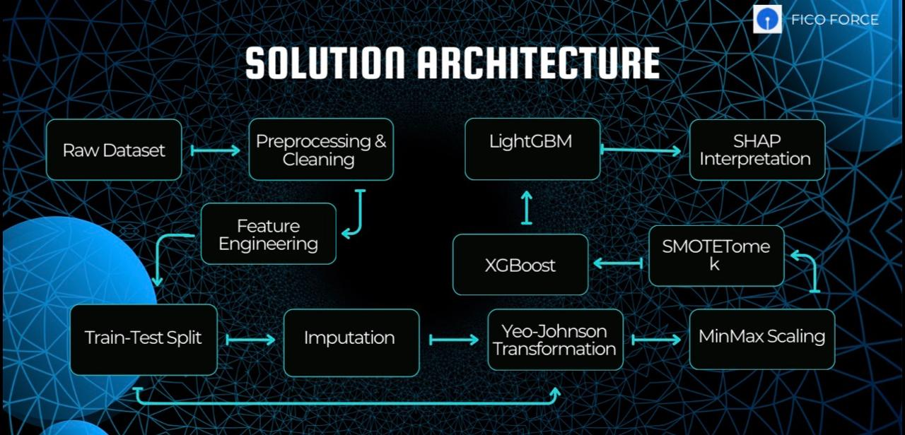
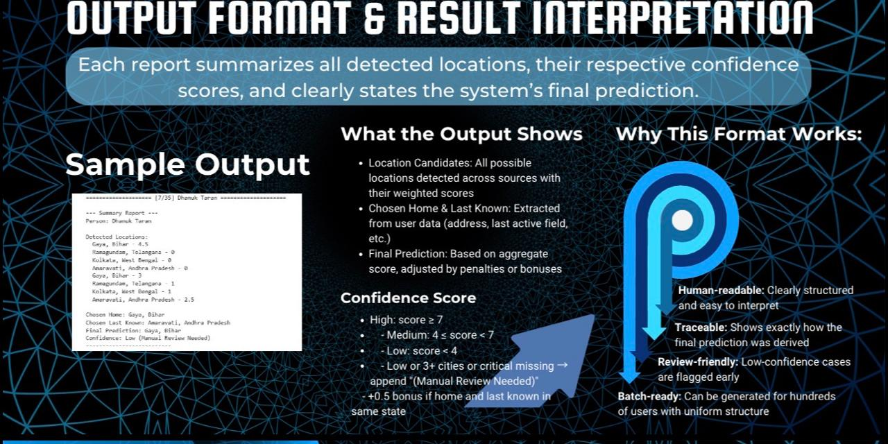
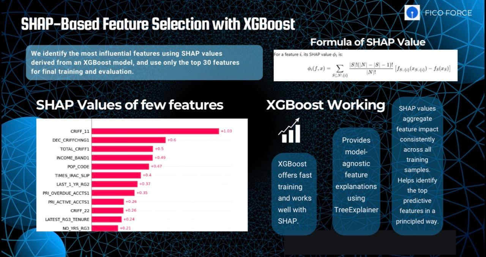
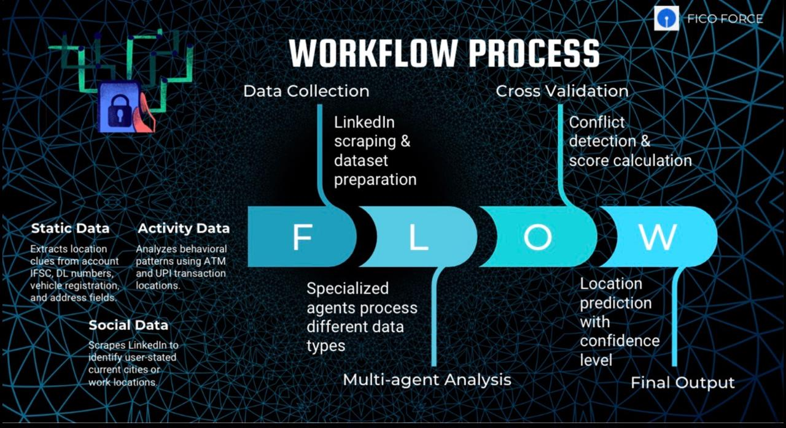

📋 FILE CONTENT (README.md) — delete everything and paste this:
markdown# 🏦 Loan Fraud Detection System


A two-part fraud detection system combining **ML-based loan default prediction** with a **multi-agent AI pipeline** for borrower location verification — built for a national-level hackathon.

---

## 💡 Problem Statement


---

## 🏗️ Solution Architecture


---

## 📁 Project Structure
```
📦 Loan-Fraud-Detection
├── 📂 backend/            # FastAPI app serving the model
├── 📂 frontend/           # UI for credit officers
├── 📓 Task_1_Loan_Default_Prediction.ipynb
├── 📓 Task_2_Location_Fraud_Agent.ipynb
├── 📄 requirements.txt
└── 📄 README.md
```
---

## 🧠 Task 1 — Loan Default Prediction

### Methodology
1. **Data Cleaning** — binary flag encoding (Y/N → 1/0), duration parsing (`2 yrs 3 mon` → months), income band ordinal encoding
2. **Feature Engineering** — `overspend_ratio`, `max_consec_overspend`, `outbal_slope`, `slope_MTD`
3. **Preprocessing** — Yeo-Johnson power transform + MinMax scaling + median imputation
4. **Class Imbalance** — SMOTE-Tomek resampling
5. **Feature Selection** — SHAP values on preliminary XGBoost → top 30 features selected
6. **Final Model** — LightGBM with optimized decision threshold via precision-recall curve

### Feature Scaling & Preprocessing


### Class Imbalance Handling


### SHAP Feature Importance


### Results

| Metric | Score |
|---|---|
| Accuracy | 90% |
| F1 Score | 60% |
| Precision | 61% |
| Recall | 61% |


---

## 🤖 Task 2 — Multi-Agent Location Verification

A **LangGraph-powered 4-agent pipeline** that cross-references multiple data sources to verify whether a borrower's declared location matches their actual activity patterns — a key signal for fraud detection.

### Why AI Agents?


### Agent Architecture
```
Input Data
|
v
[Agent 1: Static Verifier]
- Branch Code, DL Number, Vehicle Number, Address, Phone Prefix
|
v
[Agent 2: Activity Verifier]
- ATM Transactions, UPI Location, LinkedIn (scraped), Frequent/Last Location
|
v
[Agent 3: Cross Validator]
- Applies conflict penalties, detects multi-city anomalies
|
v
[Agent 4: Final Scorer]
- Output: Predicted Location | Confidence: High/Medium/Low | Manual Review flag
```
### Agents Workflow


### Scoring Logic

| Data Source | Weight |
|---|---|
| ATM Transaction Location | +3.0 |
| UPI Location | +2.5 |
| DL Number (State) | +2.0 |
| Branch Code | +2.0 |
| LinkedIn Location (scraped) | +1.5 |
| Address | +1.5 |
| Vehicle Number (State) | +1.0 |
| Frequent / Last Location | +1.0 |
| Phone Prefix | +0.5 |
| State conflict penalty | -2.0 per conflict |

### Confidence Levels
- **High** — score ≥ 7
- **Medium** — 4 ≤ score < 7
- **Low** — score < 4 → triggers Manual Review flag

---

## 🖥️ Frontend UI


---

## 🚀 Getting Started

### 1. Clone the repo
```bash
git clone https://github.com/Shradd7/Loan-Fraud-Detection.git
cd Loan-Fraud-Detection
```

### 2. Install dependencies
```bash
pip install -r requirements.txt
```

### 3. Set your Groq API key (Task 2)
In `Task_2_Location_Fraud_Agent.ipynb`, replace:
```python
GROQ_API_KEY = "YOUR_GROQ_API_KEY"
```
Get a free key at https://console.groq.com

### 4. Start the backend API
```bash
cd backend
uvicorn main:app --reload
```

### 5. Run with Docker
```bash
docker-compose up
```
- Backend API → http://localhost:8000
- API Docs → http://localhost:8000/docs
- Frontend → http://localhost:3000

---

## 🛠️ Tech Stack

| Category | Tools |
|---|---|
| ML Modeling | XGBoost, LightGBM, Scikit-learn |
| Explainability | SHAP |
| Resampling | imbalanced-learn (SMOTE-Tomek) |
| Multi-Agent AI | LangGraph, LangChain |
| LLM | LLaMA3-70B via Groq |
| Web Scraping | Selenium, webdriver-manager |
| Backend | FastAPI, Uvicorn |
| Frontend | HTML, CSS, JavaScript |
| Data | Pandas, NumPy, SciPy |

---

## 🎯 Conclusion

The system achieved **90% accuracy** with **60% F1 score**, **61% precision**, and **61% recall** on an imbalanced banking dataset — demonstrating that combining SMOTE-Tomek resampling with SHAP-based feature selection and threshold optimization produces reliable default predictions even under severe class imbalance.

The multi-agent Task 2 pipeline adds a layer of identity verification that purely ML approaches miss — cross-referencing 9 real-world signals to flag location anomalies with explainable confidence scores, enabling human reviewers to prioritize high-risk cases efficiently.

---

## 🔮 Future Work
- Deploy Task 1 model as a FastAPI endpoint with real-time scoring
- Replace Selenium scraping with official LinkedIn API
- Add real-time fraud scoring dashboard
- Extend agent pipeline to verify social media consistency

---

## 👤 Author
**Shradd7** — [GitHub](https://github.com/Shradd7)